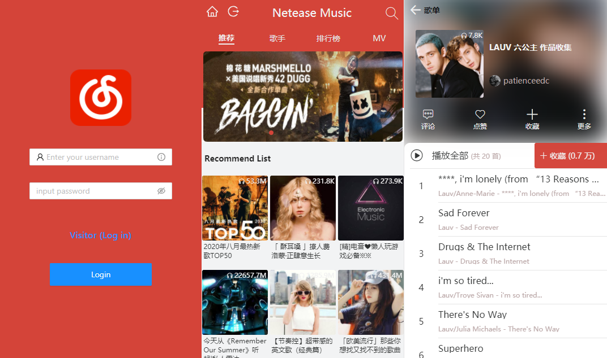
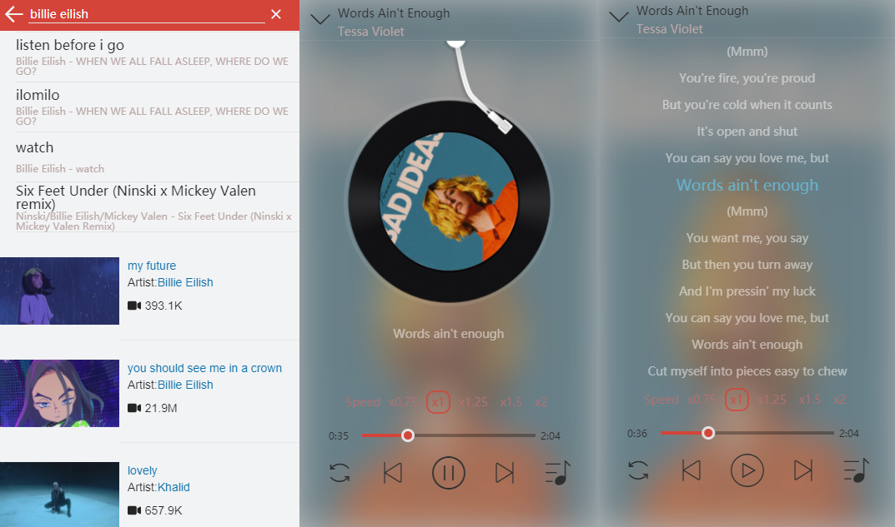
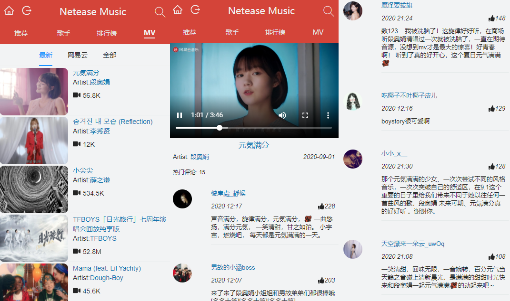

# Music Web App

**Online Address: https://fleetingsound.us**


## Features

- **Netease Music** user login, visitor login.

- Recommended playlist  and carousels display.

- Search page (Singer, MV, and Album)

- MV List (Options: Popular, Latest and Netease exclusive MV)

- Get popular singer information.

- Lazy loading and automatic page turning

- Watch the MV, browse the latest and hot comments.

- Play the song, adjust the progress, view the lyrics and adjust the waitlist.

  

## Stack

Front End:   **React + Redux + Antd UI+ CSS-IN-JS +CREATE-KEYFRAME-ANIMATION**

Server:    [NeteaseCloudMusicApi](https://github.com/Binaryify/NeteaseCloudMusicApi) ( from Github repositories )

Deployment: **Nginx & Node**

## Installation & Run

1. Server Install packages:

   ```js
   > npm install 
   Or
   > yarn
   
   Run
   >npm run start
   ```

2. Front End  install packages:

   ```js
   > npm install 
   Or
   > yarn
   Run
   >npm run start
   ```

3. Attention: 

   As this project use separate Antd components. After installed the node_modules, it is needed to change webpack settings in 

   react-scripts/config/webpack.config.js

   ```js
    babelrc: true                       (line 391)
   ```

4. About access permission:
   + If you are Netease Music user, besides the user Login, it is needed to set proxy in the Server Files. (See [Netease API ](https://binaryify.github.io/NeteaseCloudMusicApi/#/?id=%e5%8f%af%e4%bb%a5%e4%bd%bf%e7%94%a8%e4%bb%a3%e7%90%86) )
   + For paid songs and geographic restricted songs, visitors are not authorized to access.


## ScreenShots

**1.Login Page & Recommend Page**




**2. Search  & Play** 




**3. MV List & Watch &Comments**


